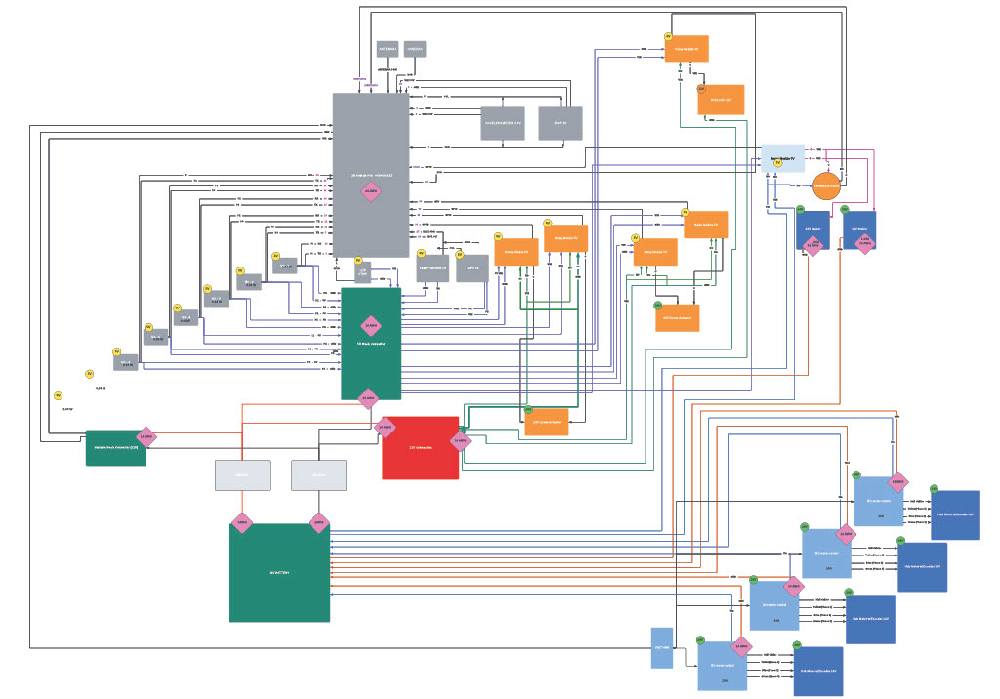

I participated in the 2022-2023 AEVS(Autonomous Electrical Vehicle System) project as part of the electrical team. During this project, I learned many things about working with a physical electronic system, as well as working effectively in a team environment. 

During the beginning of the project, I worked on planning out all of the necessary components and wiring.  After creating an inventory list, I made a wiring diagram which included pin designations, voltage, amperage, and wire gauges.  
Click on the image to get a closer look at the wiring. <a href=http://www.adobe.com/prodlist.pdf>

For this project, I was the lead programmer who was responsible for programming the various capabilities of the mouse.  I started by programming the basics, such as sensor polling and motor actuation using interrupts.  From there, I then programmed the basic PD controls for the motors of the mouse.  The PD control the drive so that the mouse would stay centered while traversing the maze and keep the mouse driving straight.  I also programmed basic algorithms used to solve the maze such as a right wall hugger and a left wall hugger algorithm.  From there I worked on a flood-fill algorithm to help the mouse track where it is in the maze, and to map the route it takes.  We finished with the fastest mouse who finished the maze within our college.

You can learn more at the [UH Micromouse News Announcement](https://manoa.hawaii.edu/news/article.php?aId=2857).
