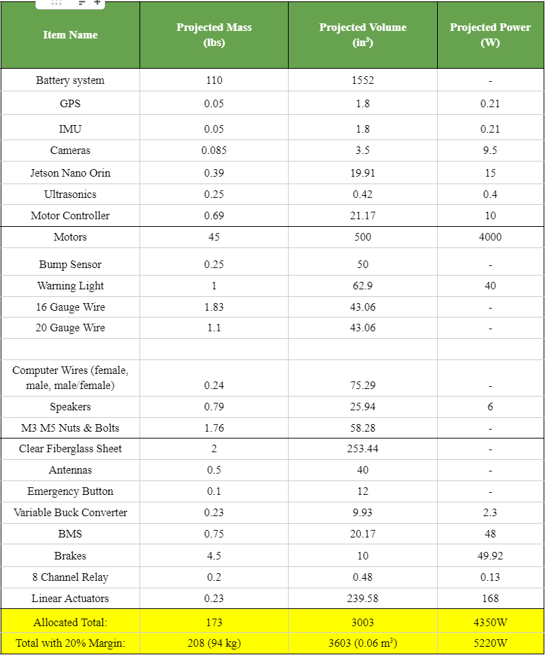

The AEVS, or autonomous electric vehicle system, is an autonomous delivery robot created to deliver packages around campus.  The AEV is able to navigate its way throughout campus with its array of sensors, consisting of LIDAR, Ultrasonic Sensors, and cameras. To control the sensors, we are using a Jetson Nano Orin, and for the powertrain, we are using two 2000w motors and brakes to power our vehicle.  To open the vehicle, we are using two linear actuators for our door.  A control center will be located in the POST building, which will be connected to the vehicle by wifi.  As Electrical Systems Lead, I was tasked with managing all of the electronics in the system.

 
 
 
 
During the start of our project, it was necessary for us to create a Electrical Budget sheet.  This sheet would contain all of the parts that we are planning on using, and its mass, volume, and power included in each part. Some notable mentions from these parts we are using are the IMU, 
 
